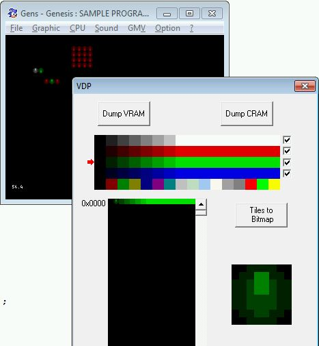

SGDK provides 2 API to handle _Background_

### High Level API: MAP ###

This is the API you should use by default as it's easy to use and allow to handle large background map.
Internally it uses the _MAP_ resource which is optimized to encode large background level data with minimum ROM place (you can find more info about it in [rescomp.txt file](https://raw.githubusercontent.com/Stephane-D/SGDK/master/bin/rescomp.txt)).

1. So first you need to define your _MAP_ resource which represents a complete level background.
Here's an example (taken from _sprite_ sample):

`TILESET bga_tileset "gfx/S1_GHZ1_FG.png" BEST ALL`
`MAP bga_map "gfx/S1_GHZ1_FG.png" bga_tileset BEST`

As you can see, _MAP_ resource requires the _TILESET_ resource to be defined first (_bga_tileset_ here), we did that way so you can share your _TILESET_ resource with several _MAP_ resources.

1. Then when your _MAP_ resource is properly defined, you need to use _MAP_xx_ methods to deal with it.


which It's highly recommended to use MAP this We highly recommend This is the recommended API Using the MAP resource

WARNING: A bunch of constants have been renamed after commit: https://github.com/Stephane-D/SGDK/commit/c1ce6edbefa4eddc709aec24af0aec9fbe5df84f 

If you read documents linked on [first part](Tuto-Hello-World), you should know how to write more than 'Hello World' on screen :
  * the Genny redraws 2 planes on refresh (+ a third one for the sprites)
  * each plane is filled with 8x8 pixel tile
  * each plane can be a maximum of 4,096 tiles in memory (at dimensions 32x32, 32x64, 64x64, or 32x128, with up to 40x28 visible on screen)
  * each plane is filled from left to right and top to bottom
  * each tile could be used several times in any plane, with the same pal or not
  * each tile could be used with any of the 4 pal available
  * each tile could be drawn flipped, w/o more memory
  * a very important amount of tiles could be loaded using DMA

### Basic ###
Some other data you should know :
  * one tile is made of 32bytes : 4byte per line
  * each pixel of the tile is so a 4bit value which is the color index, from 0x0 to 0xF
  * the first tile (tile 0) on VRAM will be used to fill the background
  * SGDK initialize enough space on VRAM for 1310 tiles (+ 96 for the font)
  * a tile is also called a pattern or a char
  * a tile on screen isn't removed on refresh (i.e. no need to draw it each refresh!)
  * a pal is 16 colors wide

So, the steps to draw a tile on screen are the following
  1. load the tile on VRAM (we don't bother about DMA yet)
  1. load its pal (if not already loaded)
  1. plot it on the selected plane, at (x,y) with the wanted pal

But first, we need a tile !

Rescomp and others tools made by the community ([Genitile](http://www.pascalorama.com/article.php?news=28&cat=21), [B2T](http://gendev.spritesmind.net/page-b2t.html), [GenRes](http://gendev.spritesmind.net/page-genres.html), Mega-Happy-Sprite...) let you convert a 16 color bitmap in Genny's tile and pal.

But, to learn, we'll first make it the hard way : pure C Array !

```
const u32 tile[8]=
{
		0x00111100,
		0x01144110,
		0x11244211,
		0x11244211,
		0x11222211,
		0x11222211,
		0x01122110,
		0x00111100
};
```

Our tile is only made of color 0, 1, 2 & 4.

Now, just follow the steps

```
	// ... code
	
	//we load our unique tile data at position 1 on VRAM
	VDP_loadTileData( (const u32 *)tile, 1, 1, 0); 
	
	//we'll use one of the pre-loaded pal for now
	
	//write our tile 1 on plane A at (5,5) with pal 0
	VDP_setTileMapXY(PLAN_A, 1, 5, 5);
	
	// ... code
	
	while(1)
	{
		// ... code
		VDP_waitVSync();
	}
	
```

The tile is so drawn on screen using some fade of grey...but what about flipping and pal ?

The 2nd argument of `VDP_setTileMapXY` function could be more than only the tile index.

It is, in fact, the tile properties : pal index, priority, V-flipping, H-flipping, and tile index.

So, to write it flipped green on B plane, you could write

```
	// ... code
	
	//PAL2 = green pal
	// 0 = low priority
	// 1 = vflip
	// 0 = no hflip
	// 1 = tile 1
	VDP_setTileMapXY(PLAN_B, TILE_ATTR_FULL(PAL2, 0, 1, 0, 1), 6, 5);
	
	// ... code
```


It's now time to talk about the priority flag.

This flag tell which plane is behind the others (even more complex if you add sprites !).

A powerful feature of the Genny is to let the developer define the planes order at the tile level.

It means a tile on A plane could be in front of a tile on B plane at (x,y) and inverse the priority at (n,m).

You could easily see the power of this when scrolling planes at different speed for example.

```
	// ... code
	
	// the same tile is drawn on the 2 plane but with different pal and priority...which one is in front ?
	VDP_setTileMapXY(PLAN_A, TILE_ATTR_FULL(PAL1, 1, 0, 0, 1), 7, 7);
	VDP_setTileMapXY(PLAN_B, TILE_ATTR_FULL(PAL2, 0, 0, 0, 1), 7, 7);
	VDP_setTileMapXY(PLAN_A, TILE_ATTR_FULL(PAL1, 0, 0, 0, 1), 8, 7);
	VDP_setTileMapXY(PLAN_B, TILE_ATTR_FULL(PAL2, 1, 0, 0, 1), 8, 7);
	
	// ... code
```

Here, at (7,7) plane A is in front of plane B but, at (8,7), plane B is in front of plane A.


But, what will happen if the planes get the same priority ?

The default order is kept: plane A is in front of plane B.


### Fill ###

To fill a screen, you have to draw each tile one by one !

Very boring but, hopefully, SGDK came to the rescue with `VDP_fillTileMapRect`.

```
	// ... code
	
	// fill a 8x8 square of blue tile at (12,12)
	VDP_fillTileMapRect(PLAN_B, TILE_ATTR_FULL(PAL3, 0, 0, 0, TILE1), 12, 12, 8, 8);
	
	// ... code
```


Download : [Basic tiles project](files/tut3_TilesBasic.zip)


### Multi tile ###

It will be hard to make a game using one and unique tile.

We'll try now to draw this moon on screen


2 important things to check before to continue
  1. the bitmap size should be 8 pixel aligned (i.e. : 64x32 is good where 67x31 isn't)
  1. the bitmap should be 4bpp or 8bpp and respect megadrive color constraints (16 colors per tile and no more than 64 colors at max)...

For this moon, you will have 8x8 tiles loaded.

SGDK is able to handle many type of resources file (PNG file are also accepted), you just need to define them in a .res file and rescomp will compile them (see rescomp.txt to see how to define your resources) and generate a 'name\_of\_res\_file.h` and a `name\_of\_res\_file.o`

`name_of_res_file.o` is the object form of your compiled resources.

`name_of_res_file.h` contains the resource declarations and let you access, for instance, your bitmap image as a Bitmap data structure.

So, after compiling the moon as an IMAGE in the .res file, and including `moon.h`, you could load the bitmap on VRAM and immediately draw it this way.

```
#include "moon.h"

int main( )
{
	// get the palette data of moon
	VDP_setPalette(PAL1, moon.palette->data);

	// load bitmap data of moon in VRAM and draw
	VDP_drawImageEx(PLAN_A, &moon, TILE_ATTR_FULL(PAL1, 0, 0, 0, 1), 12, 12, 0, CPU);

	while(1)
	{
		VDP_waitVSync();
	}

	return 0;
}
```


Download : [Bitmap tiles project](files/tut3_TilesBitmap.zip)


### Compression ###

If you use a large amount of tiles, we strongly suggest you to compress them (using RLE, huffman, ...).

Compression is defined at resource declaration level, the last parameter of BITMAP resource allow you to define which type of compression to use (see rescomp.txt file for more details).


### Misc ###

One useful way to test your tile engine is through [Gens KMod](http://gendev.spritesmind.net/page-gensK.html).

You could explore the VRAM and trace any issue.

