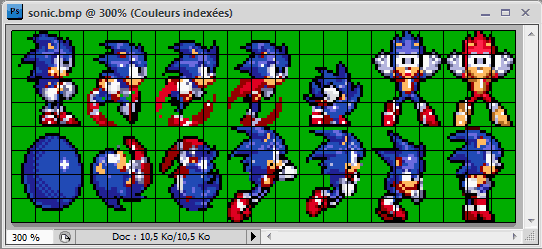
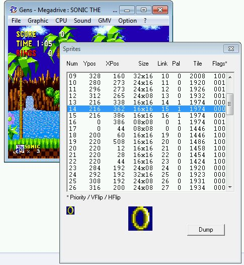

## High Level API: Sprite Engine ##

**This is the API you should use by default as it's much easier to use than lower level API and should work for almost all situation.** This said, the only case where low level may be preferable is when you have lot of (small) sprites and that performance start to be a problem (see in Low Level API part).<br>
<br>
Internally the _Sprite Engine_ uses the _SPRITE_ resource (compiled as _SpriteDefinition_) which is basically a sprite sheet where each row represents an animation and cell represents a single animation frame.
You can find more info about _SPRITE_ resource in [rescomp.txt file](https://raw.githubusercontent.com/Stephane-D/SGDK/master/bin/rescomp.txt)).<br>
<br>
So let's see how that works..

* First you need to define the _SPRITE_ resource (_.res file) representing your complete sprite sheet (see the [sprite sample](https://github.com/Stephane-D/SGDK/tree/master/sample/sprite) example):<br>
  `SPRITE sonic_sprite "sprite/sonic.png" 6 6 FAST 5`

* Then on code part, if not already done, don't forget to initialize the _Sprite Engine_ using `SPR_init()`

* After that, create/add your sprite from the SpriteDefinition (generated from _SPRITE_ resource):<br>
  `Sprite* player = SPR_addSprite(&sonic_sprite, fix32ToInt(posX) - camPosX, fix32ToInt(posY) - camPosY, TILE_ATTR(PAL0, TRUE, FALSE, FALSE));`<br>
  Be careful with compression on _SPRITE_ resource, for streamed sprite (which is the default) don't use _BEST_ compression as it's too slow, and only use _FAST_ compression when it's really useful (main character with many animation for instance) as it's taxing on CPU.

* Now you have your Sprite object you can move it, flip it, hide it, change its animation / frame.. using these methods:
  * `SPR_setPosition(Sprite* sprite, s16 x, s16 y);`
  * `SPR_setHFlip(Sprite* sprite, u16 value);`
  * `SPR_setVisibility(Sprite* sprite, SpriteVisibility value);`
  * `SPR_setAnimAndFrame(Sprite* sprite, s16 anim, s16 frame);`
  * `SPR_setFrame(Sprite* sprite, s16 frame);`
  * `SPR_nextFrame(Sprite* sprite);`

* You can also change sprite setting or behavior (VRAM, sprite allocation, delayed update, tile upload..) using these methods:
  * `SPR_setVRAMTileIndex(Sprite* sprite, s16 value);`
  * `SPR_setSpriteTableIndex(Sprite* sprite, s16 value);`
  * `SPR_setAutoTileUpload(Sprite* sprite, bool value);`
  * `SPR_setDelayedFrameUpdate(Sprite* sprite, bool value);`
  * `SPR_setFrameChangeCallback(Sprite* sprite, FrameChangeCallback* callback);`

* At the end, when you modified all your sprites positions / frame index.. you need to simply call:<br>
 `SPR_update()`<br>
  to apply the changes.

* When you don't need it anymore, you can remove / delete your sprite using `SPR_releaseSprite(sprite)`

And that is :) There is more to learn about the _Sprite Engine_ but you have the basics to start playing with it.<br>
Be sure to check the _[sonic sample](https://github.com/Stephane-D/SGDK/tree/master/sample/sonic)_ which is a good example about how use the Sprite Engine. Also don't hesitate to browse the _[spr_eng.h](https://github.com/Stephane-D/SGDK/blob/master/inc/sprite_eng.h)_ file to see all available methods and read theirs description, that will help you for sure.

## Low Level API: VDP_spr ##

The _Sprite Engine_ makes sprites management much easier and still give you a lot of control in the way you can handle them (streamed, fixed location, pre-loaded, depth, delayed update, frame change callback..). But this comes at a price: speed. When you have many sprites the _Sprite Engine_ starts to consume a lot of CPU time so in certain situations, specially when you have lot of sprite to handle and that you don't need any meta-sprite, it may be better to manage them the hard way using the low level API (_VDP_spr_ unit).

**WARNING**
The following tutorial is outdated and mat not be 100% accurate regarding the recent changes in SGDK.
It will be updated soon...

----------------------

## Sprites ##

**WARNING**
If you read documents linked on [first part](Tuto-background), you should know the main difference between tiles for sprites and tiles for planes:
  * the plane draws the tiles from left to right THEN top to bottom (ie row order)
  * the sprite draws the tiles from top to bottom THEN left to right (ie column order)

It's why we can't use the same methods to draw sprites than to draw plane tiles.

The good news is that it is the way to DRAW which is different, not the way to load it.

Planes and Sprites uses tiles loaded on the VRAM.

So yes, you could use tiles for planes, sprites or the two at the same time !

### Basic ###

Some other data you should know about sprites
  * the sprite "plane" is, unlike the 2 others playfield, not scrollable and fixed size (512x512 in common case)
  * it means only a part of the sprite plane is visible, this part starts at (128,128)
  * any sprite outside this display area is so not visible
  * sprite position "rolls" : ex (300, 812) is the same as (300, 300)
  * you can control the order to draw the sprites using a _link_ property
  * max 80 sprites could be defined in PAL mode
  * max 20 sprites could be draw on a same line in PAL mode
  * sprites are made of 1x1 to 4x4 tiles (so **big** sprites are in fact multi sprites)

So, the steps to draw a sprite on screen are
  1. load the tiles on VRAM
  1. load its pal (if not already loaded)
  1. define it
  1. (define the other ones)
  1. ask for drawing

Like before, we will first define the tiles in pure C Array.

We want a 2x2 sprite so we need 4 tiles :

```
const u32 spriteTiles[4*8]=
{
		0x00001111, //Tile Top Left
		0x00001111,
		// ...

		0x11112222, //Tile Bottom Left
		0x11112222,
		// ...

		0x11110000, //Tile Top Right
		0x11110000,
		// ...

		0x22221111, //Tile Bottom Right
		0x22221111,
		// ...

};

```

This sprite has the same shape we used in tile basic tutorial.

Now, just follow the steps

```
	// ... code
	
	//load the tiles on VRAM
	VDP_loadTileData( (const u32 *)spriteTiles, 1, 4, 0); 
	
	//load its pal (if not already loaded)
	//we'll use one of the pre-loaded pal for now
	
	//define it
	// arg0 : sprite idx (from 0 to 79)
	// arg1 : x
	// arg2 : y
	// arg3 : size (from 1x1 to 4x4 tiles)
	// arg4 : tile(s) attributes
	// arg5 : link property (more on this later)
	VDP_setSprite(0, 40, 40, SPRITE_SIZE(2,2), TILE_ATTR_FULL(PAL0,1,0,0,1), 0);
 
	// ask for draw
	VDP_updateSprites();
	
	// ... code
	
	while(1)
	{
		// ... code
		VDP_waitVSync();
	}
	
	// ... code
```

Important things to note
  * you could define as much sprites (80 max) as you need before ask for drawing
  * using SGDK, sprite position is based on the display area not the sprite plane, which means x=0 & y=0 mean (0,0) on screen and (128,128) on sprite plane
  * SPRITE\_SIZE is needed to pass the useful value (0000b for 1x1, 0101b for  2x2, etc...)
  * TILE\_ATTR\_FULL is the same macro you use with tiles

A sprite is mainly used for moving object, so you will mostly update the x,y of the sprites.

Using the `VDP_setSprite` is making thing difficult : you have to re-set the sprite each times.

A useful way is to use a structure to maintain the sprite properties, change what need to be changed and update sprites.

This could be done using `VDP_setSpriteP` and a `_spritedef` type object.

```
	// ... code
	
	_spritedef mySprite;
	
	mySprite.posx = 0;
	mySprite.posy = 0;
	mySprite.size = SPRITE_SIZE(2,2);
	mySprite.tile_attr = TILE_ATTR_FULL(PAL0,1,0,0,TILE1);
	mySprite.link  = 0;
	VDP_setSpriteP(0, &mySprite);
	
	// ... code
```

and, to make it move,

```

	// ... code
	while(1)
	{
		mySprite.posx++;
		mySprite.posy++;
		VDP_setSpriteP(0, &mySprite);

		VDP_updateSprites();

		VDP_waitVSync();
	}

```

Of course, you could use `VDP_setSprite` or `VDP_setSpriteP`, it doesn't matter. SDGK gives you `VDP_setSpriteP` to make it easiest.

For now, we didn't talk about _link_ property yet and, unless you understand its use, you won't be able to draw more than 1 sprite.

The _link_ property contains the index of the next sprite to draw (with last one getting back to sprite 0).

This means that, using our first test, you will only draw sprite 0 (since its link property is 0).

```
mySprite.link  = 0;
```


To draw 2 sprites (sprite 0 then sprite 1), you should use

```
	// ... code
	
	mySprite.link  = 1; //link to next sprite
	VDP_setSpriteP(0, &mySprite);

	// ... code
	mySprite2.link  = 0; //mySprite2 is the last one so loop back to sprite 0
	VDP_setSpriteP(1, &mySprite2);
	
	// ... code
```

The _link_ property is so also used to define the order to draw sprites : the first one will be below the next one.

It so lets you control which and when a sprite could be drawn.

You could easily define a sprite but not drawn it like this

```
	// ... code
	
	mySprite.link  = 2; //link to sprite index 2
	VDP_setSpriteP(0, &mySprite);

	// ... code
	mySprite2.link  = 2; // 
	VDP_setSpriteP(1, &mySprite2);
	
	// ... code
	mySprite3.link  = 0; // back to sprite 0 so sprite 1 won't be drawn
	VDP_setSpriteP(2, &mySprite3);
	
	// ... code
```

Of course, you can't avoid sprite 0.

**BEWARE**: a misuse of the _link_ property is the main reason of bugs. 3 things to check:
  1. each one of you sprite link to another one
  1. there is no cycling link (for ex : 1->2, 2->3, 3->1 ...)
  1. the last sprite links back to sprite 0

The full use of linking is useful only on very special case (like the dragon boss on Space Harrier for ex).

So, for now, you should avoid problems and always link to next sprite and get back to sprite 0.

Download : [Basic sprites project](files/tut4_SpritesBasic.zip)


---

### Rescomp SPRITE support ###

We will talk about the `SPRITE` mode this time.

As you know, Rescomp relies on a resource declaration file where each line defines the convert mode, the output name, the file and some parameters.

With `SPRITE`, it could be done this way :

```
	SPRITE output_var_name "gfx/file.bmp" <sprite_width> <sprite_height> <compression> <time>
```

If you write it down in a `resource.res`, SGDK will call Rescomp to compile `gfx/file.bmp` to a linked `resource.o`.

Read the rescomp.txt file located in SGDK's `bin` folder to have more information about the SPRITE resource definition.

The idea is to define your sprites sheet into an image so rescomp will convert it to a `SpriteDefinition` structure that you could use with the SGDK sprite engine.
What is a sprites sheet ? a sheet with several sprites in correct position.

If you have 3 sprites of 16x32, the first one will be at (0,0), the 2nd at (16,0) and the 3rd at (32,0) or (0,32).



This one is valid. The black grid is Photoshop's one, it should not be drawn on the bitmap.

So, with this sheet, using `sonic.animations[0]->frames[6]` will give you the data for first row animation / sprite 6: Red Sonic.

Currently this tutorial is incomplete (it will be completed soon) but in the meantime i invite you to have a look on the provided `sprite` sample into SGDK to have a better understanding about how use the SGDK sprite engine and SPRITE resource.

---


### Misc ###

One useful way to test your sprite engine is through [Gens KMod](http://gendev.spritesmind.net/page-gensK.html).

You could explore the sprite list and trace any issue.

